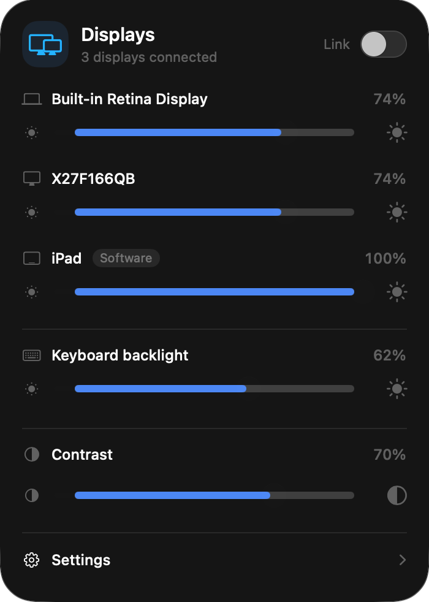

# PanelLight

Every display on your Mac, one menu bar panel. PanelLight controls the brightness of your MacBook screen, external monitors, an iPad in Sidecar, and the keyboard backlight, each with its own slider, or all together with one.

<p align="center"></p>

## Features

- **One slider per display.** Built-in display, every connected monitor, and Sidecar or AirPlay screens appear as separate rows at the same time. New displays get their own row when they connect.
- **Link.** Turn on **Link** and the rows collapse into a single **All displays** slider. The Mac's brightness keys then move every display together.
- **Hardware brightness over DDC/CI.** Monitors that support DDC/CI change their real backlight, not a filter.
- **Software dimming as a fallback.** Sidecar, AirPlay, and monitors that do not answer DDC/CI are dimmed with a click-through overlay, marked **Software** in the panel.
- **Keyboard backlight, contrast, and Night Shift.** Contrast applies to every monitor that supports it and to the built-in display through a color curve. Night Shift can be switched to warm light from Settings.
- **Open at login**, custom slider colors, and Liquid Glass on macOS 26.
- English and Turkish, following your macOS language.

## Download

Download the latest signed and notarized app from [GitHub Releases](https://github.com/berkinefeavci/PanelLight/releases/latest). Unzip it, move `PanelLight.app` to Applications, and open it. The display icon appears in the menu bar.

## Requirements and compatibility

| | |
|---|---|
| Mac | Apple Silicon (M1 or newer). Intel Macs are not supported. |
| macOS | 12 Monterey or newer. **Open at login** needs macOS 13. Liquid Glass needs macOS 26. |
| Monitor brightness | Monitors with DDC/CI turned on in their own menu, connected over USB-C or DisplayPort. The built-in HDMI port on some Macs, and some docks, adapters, and DisplayLink devices, do not pass DDC/CI; those monitors fall back to software dimming. |
| iPad / AirPlay | Software dimming only. The iPad's own backlight can be changed only on the iPad. |

Tested on a MacBook Pro (Apple Silicon) with a Fazeon X27F166QB monitor over DDC/CI and an iPad in Sidecar. Other Macs and monitors have not been tested yet. If yours does or does not work, please [open an issue](https://github.com/berkinefeavci/PanelLight/issues/new/choose) with your Mac and monitor model. That is how the compatibility list grows.

## Why it is not on the Mac App Store

Monitor brightness over DDC/CI, built-in display brightness, the keyboard backlight, and Night Shift are reached through private macOS interfaces that the App Store sandbox does not allow. Tools such as MonitorControl and Lunar are distributed outside the App Store for the same reason. A macOS update can change these interfaces; PanelLight hides a control when it stops responding.

## Privacy

PanelLight runs locally and makes no network requests on its own. See [PRIVACY.md](PRIVACY.md).

## Build from source

Requires Xcode with the macOS SDK.

```bash
./scripts/build-app.sh
open dist/PanelLight.app
```

The script builds an Apple Silicon app and ad-hoc signs `dist/PanelLight.app` for local use. Release builds are Developer ID signed and notarized by Apple.

```bash
swift test
dist/PanelLight.app/Contents/MacOS/MonitorBar --probe     # prints what PanelLight can read on this Mac
dist/PanelLight.app/Contents/MacOS/MonitorBar --preview   # opens the panel in a normal window
```

## Notes

- Percentages are device control values, not measured light output.
- Contrast on the built-in display uses a gamma curve. PanelLight restores the original curve on exit, and again on the next launch if it ever quits unexpectedly. Other color tools such as Night Shift can replace the curve while PanelLight runs.
- PanelLight does not take over the brightness keys. With **Link** on, it follows the built-in display when you press them.

## Source research

The DDC approach was informed by [traderGK/OpenDisplay](https://github.com/traderGK/OpenDisplay) (MIT), [AppleSiliconDDC](https://github.com/waydabber/AppleSiliconDDC) (MIT), [ScreenControl](https://github.com/pushbrands/ScreenControl) (MIT), and [aquitaine/OpenDisplay](https://github.com/aquitaine/OpenDisplay) (GPL-3.0-or-later). PanelLight is a separate source tree and contains no GPL source or assets.

Keyboard auto-brightness behavior was checked against [Apple's keyboard settings guide](https://support.apple.com/guide/mac-help/mchlp2265/mac) and [macos-keyboard-backlight](https://github.com/noluyorAbi/macos-keyboard-backlight) (MIT). No code was copied.

Night Shift behavior was compared with [Luma](https://github.com/heymykro/luma) (MIT). No Luma code was copied.

## License

MIT. See [LICENSE](LICENSE).
